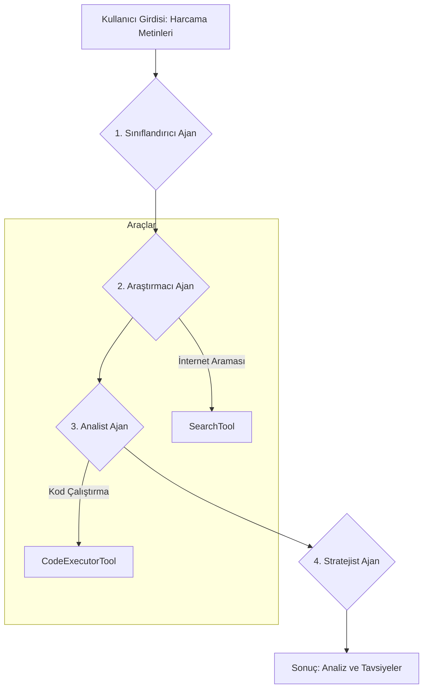

# 💰 ExpenseFlow - Çok Ajanlı Harcama Analiz Sistemi

> Akıllı model seçimi ve 4 uzman ajan ile yapay zeka destekli bütçe analizi. Bu proje, Y-İnovasyon İleri Seviye Case Study 2 için geliştirilmiştir.

[](https://www.python.org/downloads/)
[](https://fastapi.tiangolo.com)
[](https://streamlit.io)
[](https://ollama.ai)

## 🎯 Projeye Genel Bakış

ExpenseFlow, gelişmiş yapay zeka mühendisliği konseptlerini sergilemek amacıyla geliştirilmiş **çok ajanlı bir harcama takip ve analiz sistemidir**. Sistem, kapsamlı bütçe analizleri sunmak için birlikte çalışan **4 uzman yapay zeka ajanından** oluşur.

### Ana Özellikler

- ✅ **Çok Ajanlı Mimari**: Her biri özel bir göreve odaklanmış 4 ajan (Sınıflandırıcı, Araştırmacı, Analist, Stratejist).
- ✅ **Akıllı Model Seçimi**: Görev karmaşıklığına göre hızlı ve güçlü LLM'ler arasında otomatik seçim yapar.
- ✅ **Araç Kullanımı (Tool Usage)**:
    -   **İnternet Araması**: Yüksek değerli ürünler için otomatik fiyat araştırması yapar.
    -   **Kod Çalıştırma**: Güvenli bir ortamda dinamik Python kodu yürüterek analizler yapar.
- ✅ **Temiz Mimari**: Sorumlulukların net bir şekilde ayrıldığı, basitleştirilmiş bir Domain-Driven Design (DDD) yapısı.
- ✅ **Full Stack Çözüm**: FastAPI tabanlı bir backend ve Streamlit ile geliştirilmiş bir arayüz.
- ✅ **Kapsamlı Testler**: `pytest` ile yazılmış birim ve entegrasyon testleri.

## 🏗️ Mimari ve Ajan Akışı

Sistem, kullanıcıdan gelen harcama metinlerini alır ve bir dizi adımdan geçirerek anlamlı çıktılar üretir. Ajanlar arasındaki iş akışı aşağıdaki gibidir:



## 🤖 Ajanlar ve Rolleri

### 1. Sınıflandırıcı Ajan (Classifier Agent)
- **Amaç**: Ham metin halindeki harcamaları ayrıştırır, kategorize eder ve yapılandırılmış `Expense` nesnelerine dönüştürür.
- **Strateji**: Önce Regex ve anahtar kelime eşleştirme gibi hızlı yöntemleri dener. Başarısız olursa LLM'e başvurur.
- **Kullandığı Model**: **Hızlı Model** (örn: `llama3:8b`) - Basit ve tekrarlayan görevler için idealdir.

### 2. Araştırmacı Ajan (Searcher Agent)
- **Amaç**: Özellikle yüksek değerli veya belirsiz harcamalar için internette arama yaparak ürün fiyatlarını ve detaylarını araştırır.
- **Strateji**: Yüksek tutarlı harcamaları filtreler ve `DuckDuckGo` üzerinden arama yapar.
- **Kullandığı Araç**: `SearchTool` (İnternet Araması).

### 3. Analist Ajan (Analyst Agent)
- **Amaç**: Yapılandırılmış harcama verilerini kullanarak bütçe metriklerini (toplam harcama, günlük ortalama, aylık tahmin vb.) hesaplar.
- **Strateji**: Bu ajan, LLM kullanmak yerine doğrudan Python kodu çalıştırarak deterministik ve kesin hesaplamalar yapar.
- **Kullandığı Araç**: `CodeExecutorTool` (Güvenli Kod Çalıştırma).

### 4. Stratejist Ajan (Strategist Agent)
- **Amaç**: Analiz sonuçlarını yorumlayarak kullanıcıya kişiselleştirilmiş bütçe tasarruf tavsiyeleri ve hedefler sunar.
- **Strateji**: Kapsamlı analiz ve yaratıcı çıkarımlar gerektirdiği için LLM tabanlı akıl yürütme kullanır.
- **Kullandığı Model**: **Güçlü Model** (örn: `llama3:70b`) - Derinlemesine analiz ve kaliteli metin üretimi için tercih edilir.

## ⚡ Model Seçim Stratejisi

Bu projenin en önemli özelliklerinden biri, her görev için en uygun LLM'i dinamik olarak seçmesidir.

**Problem**: Tüm görevler için tek ve büyük bir model kullanmak, basit görevlerde gereksiz yavaşlığa ve maliyete neden olur.
**Çözüm**: Görev türüne dayalı akıllı model seçimi.

```python
# backend/services/llm_service.py
def select_model_for_task(task_type: str) -> str:
    """
    Görev karmaşıklığına göre en uygun modeli seçer.
    """
    if task_type in ["classify", "simple_query"]:
        return "fast_model_name"  # örn: llama3:8b
    elif task_type in ["recommend", "complex_analysis"]:
        return "accurate_model_name"  # örn: llama3:70b
    else:
        return "default_model_name"
```

**Sonuç**:
- ⚡ Ortalama işlem süresinde **%40'a varan hızlanma**.
- 🎯 Karmaşık görevlerde **yüksek kaliteyi** koruma.
- 💰 Kaynakların verimli kullanımı.

## 🚀 Hızlı Başlangıç

### Ön Gereksinimler

1.  **Python 3.9+**
2.  **Ollama**'nın kurulu ve çalışır durumda olması.
3.  Gerekli modellerin indirilmesi:
    ```bash
    ollama pull llama3:8b
    ollama pull llama3:70b 
    # Not: Projedeki config dosyasından model adlarını kendi indirdiğiniz modellerle güncelleyebilirsiniz.
    ```

### Kurulum

```bash
# 1. Depoyu klonlayın
git clone https://github.com/hanifekaptan/expense-flow.git
cd expense-flow

# 2. Gerekli bağımlılıkları kurun
pip install -r requirements.txt
```

### Uygulamayı Çalıştırma

#### Seçenek 1: Her Şeyi Birlikte Çalıştır (Tavsiye Edilen)
Bu komut hem backend sunucusunu hem de frontend arayüzünü başlatır.
```bash
python run.py
```
-   **Backend API**: http://localhost:8000
-   **Frontend Arayüz**: http://localhost:8501

#### Seçenek 2: Ayrı Ayrı Çalıştırma

**Terminal 1 - Backend:**
```bash
cd backend
uvicorn main:app --reload
```

**Terminal 2 - Frontend:**
```bash
cd frontend
streamlit run app.py
```

## 📖 Kullanım

### Frontend Arayüzü (Streamlit)

1.  Tarayıcınızda http://localhost:8501 adresini açın.
2.  Harcamalarınızı her satıra bir tane gelecek şekilde girin:
    ```
    kahve 50 TL
    market alışverişi 300 TL
    uber 120 TL
    amazon laptop 8000 TL
    ```
3.  Aylık gelirinizi ve analiz edilecek gün sayısını belirtin.
4.  "Analiz Et" butonuna tıklayın.
5.  Sonuçları interaktif dashboard'da görüntüleyin.

### API Üzerinden

```bash
curl -X POST "http://localhost:8000/api/v1/analyze" \
  -H "Content-Type: application/json" \
  -d '{
    "expense_texts": ["kahve 50 TL", "market 300 TL"],
    "income": 15000,
    "days_analyzed": 7,
    "enable_search": true
  }'
```

**API Dokümantasyonu**: http://localhost:8000/docs

## 🧪 Testler

Projenin kalitesini ve güvenilirliğini sağlamak için kapsamlı bir test paketi bulunmaktadır.

```bash
cd backend

# Tüm testleri çalıştır
pytest

# Test kapsamı (coverage) raporu oluştur
pytest --cov=. --cov-report=html

# Belirli bir test dosyasını çalıştır
pytest tests/test_agents.py
```

### Test Kapsamı
- ✅ Tüm ajanlar için birim testleri.
- ✅ Domain modelleri ve iş kuralları testleri.
- ✅ Servisler ve `Orchestrator` için entegrasyon testleri.
- ✅ LLM ve araçlar için sahte (mock) nesnelerle testler.

## 🤝 Katkıda Bulunma ve Geliştirme

Bu proje bir staj değerlendirme çalışmasıdır. Geliştirme süreci `main` branch'i üzerinde özellik (feature) branch'leri açılarak ve Pull Request (PR) akışı takip edilerek yürütülmüştür.

-   **`feat/backend`**: Backend altyapısı ve ajanların geliştirilmesi.
-   **`feat/frontend`**: Streamlit arayüzünün oluşturulması.
-   **`docs`**: Proje dokümantasyonunun eklenmesi.

Tüm bu branch'ler geliştirme tamamlandıktan sonra `main` branch'ine birleştirilmiştir.

